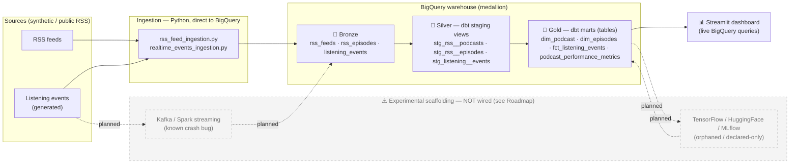
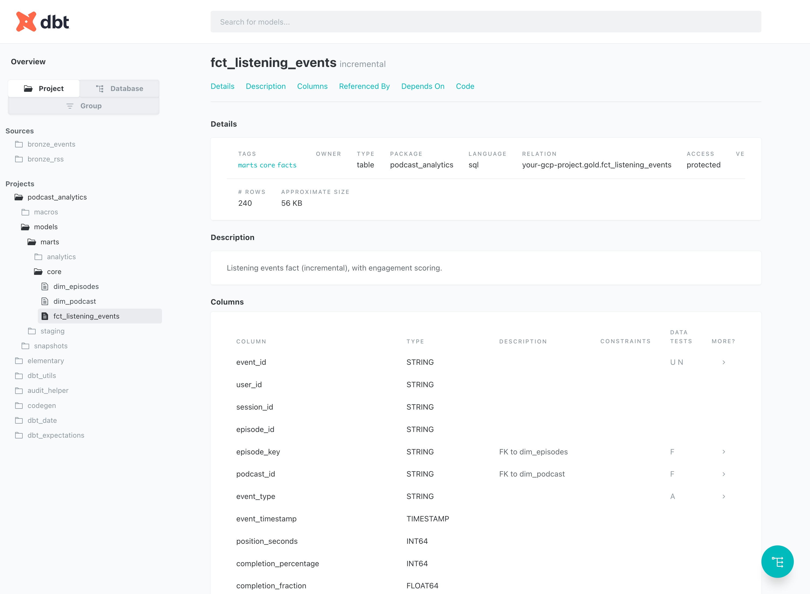
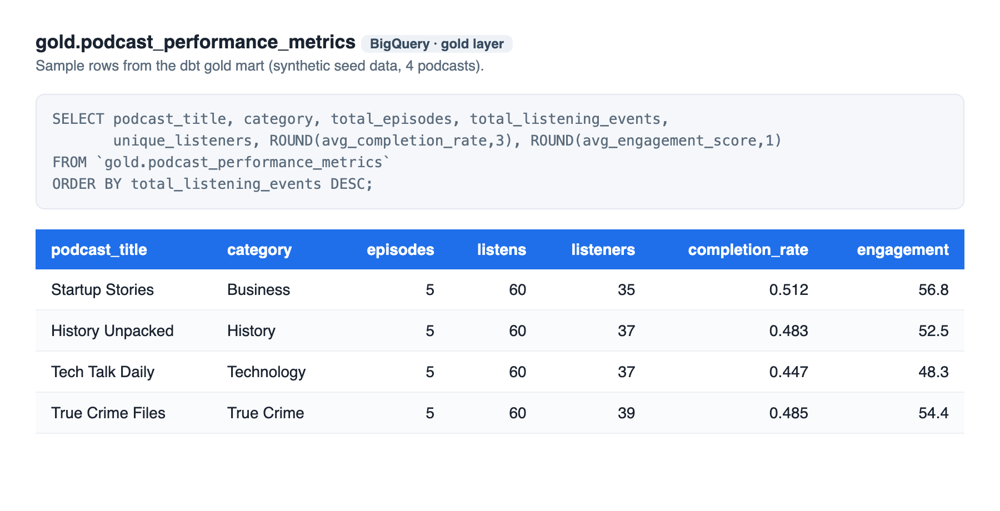
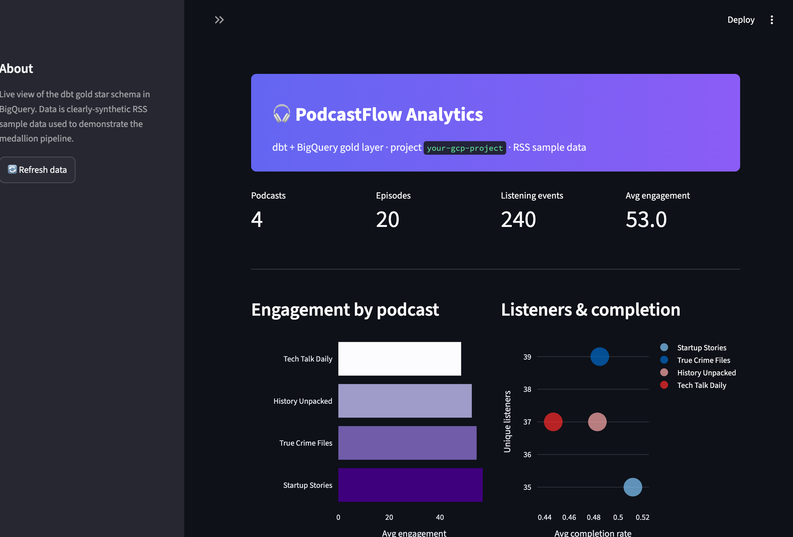
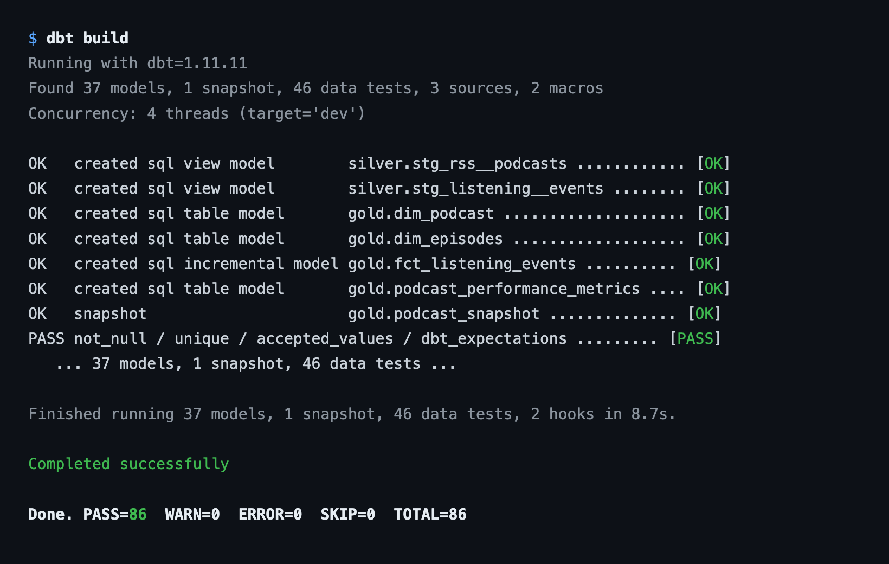

# PodcastFlow Analytics

A **dbt + BigQuery** analytics warehouse for podcast listening data, built on a medallion
(Bronze → Silver → Gold) architecture and surfaced through a Streamlit dashboard.

> **Status — honest by design**
>
> 
> 
> 
> 
> -experimental%20scaffolding-lightgrey)
>
> **The dbt + BigQuery pipeline is the working core** — it builds green (`dbt build` →
> 86 nodes succeed, 46 tests pass) against real GCP BigQuery and feeds a live dashboard.
> The **Kafka/Spark streaming layer and the TensorFlow/HuggingFace/MLflow ML layer are
> experimental scaffolding / roadmap** — present in the repo as a foundation for future
> work, **not** running systems. They are clearly labelled as such throughout. See
> [Roadmap](#roadmap).

---

## Problem & dataset

Podcast networks need a single warehouse that turns raw RSS feeds and listening events into
analytics-ready dimensions and facts (engagement, completion, episode performance).

**The data is synthetic / demo data.** Two provenance paths:

- **Committed seeds** — ~260 rows of deterministic synthetic data (4 podcasts, 20 episodes,
  240 listening events) so the pipeline runs without any external download.
- **Optional ingestion scripts** — pull *real* public RSS feeds, plus *synthetic* listening
  and social-mention generators. Nothing personal or proprietary is included.

Full provenance and regeneration steps: [`data/README.md`](./data/README.md).

---

## Architecture

Bronze (raw landing) → Silver (cleaned staging views) → Gold (dimensional marts).
The streaming and ML boxes are dashed — **scaffolding, not wired into the working path**.



A rendered PNG can be exported to `docs/img/architecture.png` — see
[`docs/SCREENSHOTS.md`](./docs/SCREENSHOTS.md) for the one-line command. GitHub renders the
Mermaid block above natively.

---

## Tech stack

### Implemented (working core)
| Area | Tech | Evidence |
|---|---|---|
| Warehouse | **Google BigQuery** (medallion: `bronze` / `silver` / `gold`) | all three dbt targets `type: bigquery` |
| Transformations | **dbt 1.11** — 7 models (3 staging views, 4 gold marts), 1 SCD2 snapshot, 46 tests | `dbt build` → 86 nodes succeed (`target/run_results.json`) |
| dbt packages | `dbt_utils`, `dbt_expectations`, `audit_helper`, `codegen`, `elementary` (observability) | `packages.yml` |
| Modelling | star schema, SCD Type 2 (`dim_podcast`), incremental fact (`fct_listening_events`), custom macros | `models/`, `macros/` |
| Dashboard | **Streamlit** querying the live gold layer | `dashboard/app.py` |
| Ingestion | Python scripts writing **direct to BigQuery** | `scripts/data-ingestion/` |
| Infra-as-code | **Terraform** provisioning BigQuery datasets (~400 lines) | `terraform/bigquery.tf` |
| Deploy | hardened **Cloud Run** `Dockerfile.cloud` + deploy script | `deployment/deploy-cloud-run.sh` |

### Planned / scaffolded (NOT built — roadmap)
| Area | Tech | Honest status |
|---|---|---|
| Streaming | Kafka, Spark Structured Streaming, Delta | **Scaffolding.** Spark job crashes on startup (`streaming/listening_events_processor.py:45` calls an undefined `configure_delta_tables()`); **no Kafka producer exists**; topics are created but never populated. |
| ML — model code | TensorFlow / Keras | **Orphaned.** Real Keras models exist (`ml/`) but train on `np.random` fallback data, persist no weights, and **never write predictions back to BigQuery** or into any dbt model. |
| ML — NLP | HuggingFace `transformers` / `sentence-transformers` | **Declared-only.** Listed in `requirements.txt`, never imported. Sentiment is a hardcoded word-list. |
| ML — tracking | MLflow | **Declared-only.** In `requirements.txt`, zero usage. |
| Orchestration | Kubernetes | Not present. Deployment target is Cloud Run (serverless). |

> Full audited breakdown with file/line evidence:
> [`docs/codebase-review/technology-validation-2026-06-25.md`](../docs/codebase-review/technology-validation-2026-06-25.md).

---

## Quick start

The working core needs **dbt + a BigQuery project**. There is no local BigQuery emulator on
the green path — the warehouse is real GCP BigQuery (free tier is sufficient).

```bash
# 0. Auth + project (free-tier BigQuery is fine)
export GCP_PROJECT_ID=<your-gcp-project>
gcloud auth application-default login        # dbt profile uses OAuth

# 1. Build + test the dbt pipeline
cd dbt_podcast_analytics
dbt deps
dbt seed        # loads the committed synthetic seeds (~260 rows)
dbt build       # runs all models + snapshot + 46 tests
dbt test        # re-run tests on their own if you like

# 2. dbt docs + lineage graph
dbt docs generate
dbt docs serve --port 8080                   # open http://localhost:8080

# 3. Dashboard (separate terminal)
cd ..
streamlit run dashboard/app.py               # http://localhost:8501
```

**Regenerate sample data** (optional — seeds already cover the green path):

```bash
# Synthetic, free-tier-sized (4 feeds, ~500 events, 50 mentions)
python scripts/setup/load_sample_data_emulator.py
# Or the fuller mix (real public RSS + synthetic events/social)
python scripts/setup/run_real_data_ingestion.py
```

---

## Results

> Screenshots to be captured — see [`docs/SCREENSHOTS.md`](./docs/SCREENSHOTS.md) for the exact
> shot list and filenames.

| | |
|---|---|
| dbt lineage graph (`dbt docs`) |  |
| Gold mart sample rows |  |
| Streamlit dashboard |  |
| `dbt build` green run |  |

---

## Roadmap

The streaming and ML layers are **deliberate next-phase scope**, scaffolded now so the
foundation (topics, compose stack, model code) is in place. Planned order of work:

1. **Make one stream demonstrable end-to-end.** Fix the Spark crash
   (`configure_delta_tables()`), add a Kafka **producer** repurposing
   `realtime_events_ingestion.py`, fix the `start.sh` compose path, and prove
   producer → topic → Spark → BigQuery with a recorded run.
2. **Wire ML into analytics.** Train the TensorFlow models on real BigQuery data, persist a
   SavedModel, write predictions back to a gold table, and add a `fct_recommendations` dbt
   model so "ML feeds analytics" becomes true.
3. **Replace the sentiment word-list** with a real HuggingFace pipeline (or drop the claim).
4. **Add MLflow tracking** around training (or drop the claim).
5. **CI:** run `dbt build` + tests on every push.

Until each item ships with a real run artifact, it stays labelled *experimental scaffolding*
here — not a built feature.

---

## Project layout

```
podcastflow-analytics/
├── dbt_podcast_analytics/      # ← the working core (models, macros, snapshot, seeds, tests)
│   ├── models/staging/         # Silver: cleaned views
│   ├── models/marts/           # Gold: dim_podcast, dim_episodes, fct_listening_events, metrics
│   ├── snapshots/              # SCD2 podcast_snapshot
│   └── sample_data/            # committed synthetic seeds
├── dashboard/app.py            # Streamlit, live BigQuery queries  (working)
├── scripts/                    # ingestion + setup (direct-to-BigQuery)  (working)
├── terraform/                  # BigQuery datasets as IaC  (working)
├── deployment/                 # Cloud Run deploy + Dockerfile.cloud  (working)
├── streaming/                  # Kafka/Spark jobs  (experimental scaffolding)
├── ml/                         # TF/HF/MLflow model code  (experimental scaffolding)
└── data/README.md             # data provenance & regeneration
```

## License

MIT (add a `LICENSE` file before publishing if one isn't present).
