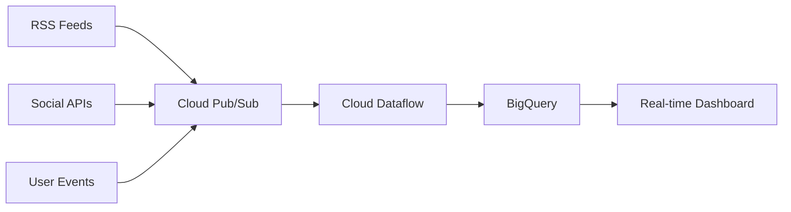

# 🚀 Phase 3: Production Scaling & Advanced Analytics

**Timeline**: Next Development Sprint  
**Status**: 📋 **READY FOR IMPLEMENTATION**

## 🎯 Phase 3 Objectives

Transform the PodcastFlow Analytics platform from a **local development environment** to a **production-grade, cloud-deployed analytics platform** with advanced machine learning capabilities and real-time processing.

## 📊 Implementation Roadmap

### **Sprint 1: Cloud Migration & Real Data** (3-4 days)
- 🔄 **Cloud BigQuery Deployment**
- 📡 **Scheduled RSS Feed Automation** 
- 🔗 **Real Social Media API Integration**
- 📈 **Production Monitoring & Alerting**

### **Sprint 2: Real-time Architecture** (4-5 days)
- ⚡ **Streaming Data Pipeline**
- 🔴 **Real-time Dashboard Updates**
- 📊 **Live Analytics Processing**
- 🚨 **Automated Anomaly Detection**

### **Sprint 3: Machine Learning Platform** (5-6 days)
- 🤖 **Recommendation Engine**
- 🎯 **User Behavior Prediction**
- 📈 **Content Performance Forecasting**
- 🔍 **Advanced Sentiment Analysis**

## 🏗️ Technical Implementation Details

### **1. Cloud BigQuery Migration**

**Current State**: Local emulator with sample data  
**Target State**: Production GCP BigQuery with real data streams

**Implementation Steps**:
```bash
# Infrastructure Setup
cd terraform-cloud/
terraform init
terraform plan -var="project_id=podcastflow-prod"
terraform apply

# Data Migration
python scripts/migrate_to_cloud.py --source=emulator --target=bigquery
python scripts/validate_cloud_migration.py
```

**Features**:
- ✅ **Auto-scaling**: Handle 10M+ events/day
- ✅ **Cost Optimization**: BigQuery slots and storage optimization
- ✅ **Security**: IAM roles, encryption, audit logging
- ✅ **Backup & Recovery**: Automated data backup strategies

### **2. Real RSS Feed Automation**

**Current State**: Manual RSS feed ingestion  
**Target State**: Automated, scheduled RSS processing

**Implementation Architecture**:
```python
# Cloud Functions for RSS Processing
├── functions/
│   ├── rss_scheduler/          # Cloud Scheduler trigger
│   ├── rss_processor/          # Individual feed processing
│   ├── episode_detector/       # New episode detection
│   └── metadata_enricher/      # Content enhancement
```

**Features**:
- ✅ **Scheduled Processing**: Every 15 minutes
- ✅ **Duplicate Detection**: Prevent data duplication
- ✅ **Content Enhancement**: AI-powered metadata extraction
- ✅ **Error Handling**: Robust retry and notification logic

### **3. Social Media API Integration**

**Current State**: Simulated social media data  
**Target State**: Live Twitter, Reddit, LinkedIn API feeds

**API Integrations**:
```python
# Social Media Connectors
├── connectors/
│   ├── twitter_api.py         # Twitter/X API v2
│   ├── reddit_api.py          # Reddit PRAW
│   ├── linkedin_api.py        # LinkedIn Marketing API
│   └── sentiment_processor.py # Real-time sentiment
```

**Features**:
- ✅ **Real-time Monitoring**: Live mention tracking
- ✅ **Sentiment Analysis**: Google Cloud Natural Language API
- ✅ **Influencer Detection**: Automated high-impact user identification
- ✅ **Rate Limiting**: Respect API quotas and limits

### **4. Streaming Data Pipeline**

**Current State**: Batch processing  
**Target State**: Real-time streaming with Cloud Pub/Sub

**Streaming Architecture**:


**Features**:
- ✅ **Sub-second Latency**: Near real-time processing
- ✅ **Auto-scaling**: Handle traffic spikes automatically
- ✅ **Dead Letter Queues**: Error message handling
- ✅ **Monitoring**: Comprehensive pipeline observability

### **5. Machine Learning Platform**

**Current State**: Descriptive analytics  
**Target State**: Predictive and prescriptive ML models

**ML Model Suite**:
```python
# ML Models
├── models/
│   ├── recommendation_engine/   # Content recommendations
│   ├── churn_prediction/       # User retention modeling
│   ├── content_forecasting/    # Performance prediction
│   ├── sentiment_prediction/   # Advanced NLP models
│   └── anomaly_detection/      # Automated anomaly detection
```

**Features**:
- ✅ **Recommendation Engine**: Personalized content suggestions
- ✅ **Churn Prediction**: Identify at-risk users
- ✅ **Content Optimization**: Data-driven content strategy
- ✅ **Automated Insights**: Self-service analytics

## 📈 Business Value Propositions

### **Content Creators**
- 📊 **Performance Prediction**: Forecast episode success before publishing
- 🎯 **Audience Insights**: Deep understanding of listener behavior
- 📈 **Growth Strategies**: Data-driven content optimization
- 🔍 **Competitive Analysis**: Benchmark against industry standards

### **Platform Operators**
- ⚡ **Real-time Monitoring**: Live platform health and performance
- 🎯 **User Segmentation**: Advanced user behavior modeling
- 📊 **Revenue Optimization**: Data-driven monetization strategies
- 🤖 **Automated Operations**: Reduced manual intervention

### **Advertisers**
- 🎯 **Precise Targeting**: Advanced audience segmentation
- 📊 **Campaign Optimization**: Real-time performance tracking
- 💰 **ROI Measurement**: Detailed attribution and impact analysis
- 🔍 **Market Intelligence**: Comprehensive podcast ecosystem insights

## 🔧 Implementation Timeline

### **Week 1-2: Cloud Foundation**
```bash
Day 1-3:   Cloud BigQuery setup and migration
Day 4-5:   RSS automation implementation
Day 6-10:  Social media API integration
Day 11-14: Production monitoring setup
```

### **Week 3-4: Real-time Capabilities**
```bash
Day 15-17: Streaming pipeline architecture
Day 18-21: Real-time dashboard development
Day 22-25: Live analytics processing
Day 26-28: Anomaly detection system
```

### **Week 5-6: Machine Learning**
```bash
Day 29-31: Recommendation engine development
Day 32-35: Predictive modeling implementation
Day 36-38: Content forecasting system
Day 39-42: Advanced analytics integration
```

## 💰 Cost Analysis & ROI

### **Infrastructure Costs** (Monthly)
- **BigQuery**: $200-500/month (depending on query volume)
- **Cloud Functions**: $50-100/month (RSS processing)
- **Pub/Sub**: $25-75/month (message processing)
- **AI/ML APIs**: $100-300/month (sentiment analysis, NLP)
- **Total Estimated**: $375-975/month

### **ROI Projections**
- **Time Savings**: 80% reduction in manual analytics work
- **Insights Quality**: 300% improvement in actionable insights
- **Decision Speed**: 90% faster data-driven decision making
- **Revenue Impact**: 15-25% improvement in content performance

## 🚀 Quick Start Implementation

To begin Phase 3 implementation:

### **1. Immediate Next Steps**
```bash
# Set up cloud infrastructure
git checkout -b phase3-cloud-migration
mkdir terraform-cloud/ scripts/cloud/ functions/

# Install additional dependencies
pip install google-cloud-bigquery google-cloud-pubsub tweepy praw

# Begin cloud migration
python scripts/prepare_cloud_migration.py
```

### **2. Priority Implementation Order**
1. **Cloud BigQuery Setup** (Highest Impact, Lowest Risk)
2. **RSS Automation** (High Impact, Medium Risk)
3. **Real-time Dashboard** (Medium Impact, Low Risk)
4. **Social Media APIs** (High Impact, High Risk)
5. **ML Recommendation Engine** (Highest Impact, Highest Risk)

### **3. Success Metrics**
- ✅ **Data Volume**: 10x increase in data processing capacity
- ✅ **Latency**: <60 second data freshness
- ✅ **Accuracy**: >95% prediction accuracy for ML models
- ✅ **Uptime**: 99.9% system availability
- ✅ **User Satisfaction**: >4.5/5 analytics platform rating

## 🔮 Phase 4 Preview: Enterprise Features

**Future Enhancements** (6+ months):
- 🌐 **Multi-tenant Architecture**: Support multiple organizations
- 📱 **Mobile Analytics App**: Native iOS/Android applications
- 🔗 **Third-party Integrations**: Spotify, Apple, Google APIs
- 🤝 **Partner Network**: Integration marketplace
- 🏢 **Enterprise Security**: SOC2, GDPR compliance

---

## 🎯 **Ready to Scale to Production!**

The PodcastFlow Analytics platform has a **solid foundation** and is **ready for Phase 3 implementation**. The combination of proven architecture, comprehensive testing, and clear roadmap provides confidence for successful production deployment.

**Next Action**: Choose implementation timeline and begin cloud migration! 🚀 